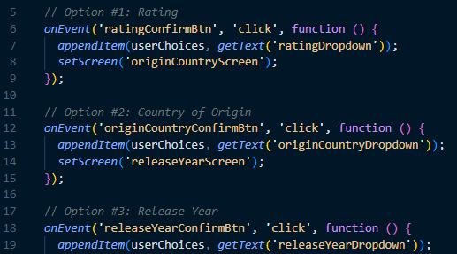
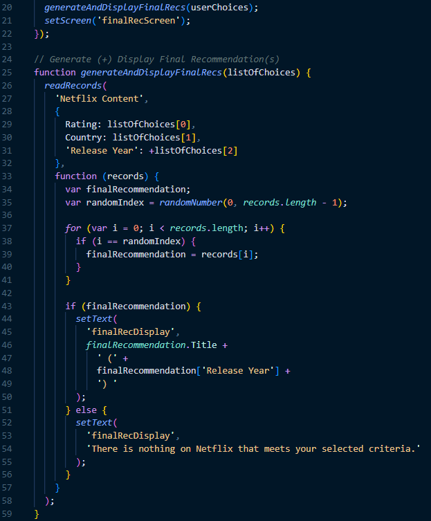
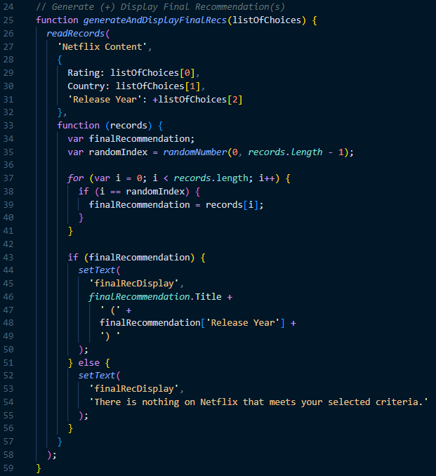
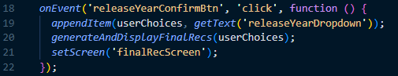

# AP CSP Create Task Exemplar: The CineChoice 2000

Programming is a collaborative and creative process that brings ideas to life through the development of software. In the Create performance task, you will design and implement a program that might solve a problem, enable innovation, explore personal interests, or express creativity. Your submission must include elements listed in the following "Submission Requirements" sections.

### Program Code Submission Requirements

In your program you must include student-developed program code that contains the following:

- Instructions for **input** from one of the following:
  - the user (including user actions that trigger events)
  - a device
  - an online data stream
  - a file
- Use of at least one **list** (or other collection type) to represent a collection of data that is stored and used to manage program complexity and help fulfill the program's purpose.
  - Note, _the data abstraction must make the program easier to develop_ (alternatives would be more complex) or easier to maintain (future changes to the size of the list would otherwise require significant modifications to the program code).
- At least one **procedure (a.k.a. "function")** that contributes to the program's intended purpose, where you have defined:
  - the procedure's name
  - the return type (if necessary)
  - one or more parameters
- An **algorithm** that includes sequencing, selection, and iteration that is in the body of the selected procedure
- Calls to your student-developed procedure
- Instructions for **output** (tactile, audible, visual, or textual) **based on input** and program functionality

### Video Submission Requirements && Exemplar

Submit one video file that demonstrates your program running. It must include:

- **input** to your program
- at least one aspect of the functionality of your program
- **output** produced by your program

It may **NOT** contain:

- any distinguishing information about yourself
- voice narration (though text captions are encouraged)

It must be:

- either .mp4, .wmv, .avi, or .mov format
- no more than 1min in length
- no more than 30mb file size

https://user-images.githubusercontent.com/91103557/224178847-d417478e-ec57-4efd-a7f2-2e9c19112947.mp4

### Exemplar Written Responses

Submit your responses to prompts 3(a) – 3(d), which are described below. Your responses to all prompts combined must not exceed 750 words (program code is not included in the word count).

**3(a).** In ~150 total words provide a written response that does all three of the following:

1. Describes the overall **purpose** of the program

   _The sheer number of movies on Netflix presents a real problem for people deciding what to watch. Choosing one can be an overwhelming and time-consuming process. My program solves this problem by helping users find a 2000s-era movie aligned with their selected preferences. It is a powerful, time-saving tool that can help countless people around the world._

2. Describes what **functionality** of the program is demonstrated in the video

   _The video demonstrates the functionality of this program by generating a movie recommendation aligned to the user's rating preference (R), desired country of origin (United States), and chosen release year (2005). The final movie recommendation was The Dukes of Hazzard, produced in the United States and released in 2005._

3. Describes the **input** and **output** of the program demonstrated in the video

   _In the video, the app prompts the user to **input** a desired rating (G - R), a country of origin (United States, India, Hong Kong, etc.), and a release year (2000 - 2009). After inputting each of their preferences, they press a confirm button, which ultimately directs them to the final screen where an appropriate recommendation is displayed. This recommendation is the **output** of this program._

**3(b).** Capture and paste two program code segments you developed during the administration of this task that contain a list (or other collection type) being used to manage complexity in your program.

1. The first program code segment must show how data have been stored in the list.

   

2. The second program code segment must show the data in the same list being used, such as creating new data from the existing data or accessing multiple elements in the list, as part of fulfilling the program’s purpose

   

Then provide a ~200 word written response that does all three of the following:

3. Identifies the **name of the list** being used in this response

   _userChoices_

4. Describes what the data contained in the list represents in your program

   _The data contained in this list represents a user-inputted rating, country of origin, and release year._

5. Explains how the selected list manages complexity in your program code by explaining why your program code could not be written or how it would be written differently if you did not use the list

   _The selected list in the code helps manage complexity by keeping track of user-selected options necessary to generate a final recommendation. If I chose not to use this list, the program code would need to rely on multiple conditional statements to check if the user has made a selection for each required option before generating the final recommendation. This process could quickly become unwieldy and difficult to manage, especially if I decided to add more options._

   _Additionally, the program code would become repetitive and hard to read without a list. For example, each conditional statement would need to check if the user has made a selection for a specific option, such as rating or country of origin, and then perform an action based on the user's input. Using a list allows the program code to store user selections in a centralized location, reducing redundancy and making it relatively easy to access the user's inputs when generating the final recommendation. Using a list helps to simplify the program code and make it more maintainable._

**3(c).** Capture and paste two program code segments you developed during the administration of this task that contain a student-developed procedure (a.k.a. “function”) that implements an algorithm used in your program and a call to that procedure.

1. The first program code segment must be a student-developed procedure that:

   - defines the **procedure's name** and return type (if necessary)
   - contains and uses one or more **parameters** that have an effect on the functionality of the procedure
   - implements an **algorithm** that includes sequencing, selection, and iteration

   

2. The second program code segment must show where your student-developed procedure is being called in your program

   

Then, provide a ~200 word written response that does both of the following:

3.  Describes in general what the identified procedure does and how it contributes to the overall functionality of the program
4.  Explains in detailed steps how the algorithm implemented in the identified procedure works. Your explanation must be detailed enough for someone else to recreate it.

    _The identified procedure in the code generates and displays a final recommendation for a 2000s-era movie based on user-selected criteria. It is critical to the overall functionality of the program because users expect an appropriate movie recommendation to be generated and displayed._

    _Here are the detailed steps of how the algorithm works:_

        1. The procedure takes a list of user-selected choices as an input parameter.
        2. The readRecords() function is called with the input parameter and queries the Netflix Content database.
        3. The database query searches for all movies in the database that match the user-selected criteria. The criteria are specified in the input parameter as a JavaScript object with properties for rating, country of origin, and release year.
        4. The resulting list of movies that match the criteria is passed to the function as the records parameter.
        5. A variable finalRecommendation is initialized to null.
        6. A random index is generated using the randomNumber() function, which returns a random integer between 0 and records.length - 1.
        7. A loop iterates over each record in the records array.
        8. If the current iteration index equals the random index generated in step 6, the current record is assigned to the finalRecommendation variable.
        9. The finalRecommendation variable is checked to see if it contains a movie record.
        10. If finalRecommendation is not null, the movie's title and release year are displayed as the final recommendation on the screen.
        11. If finalRecommendation is null, a message is displayed indicating that there is no movie in the database that matches the user's criteria.

**3(d).** Provide a ~200 word written response that does all three of the following:

1. Describes two calls to the procedure identified in written response 3(c). Each call must pass a different argument(s) that causes a different segment of code in the algorithm to execute.

   - **first call:** _generateAndDisplayFinalRecs([“R”, “United States”, “2008”]);_

   - **second call:** _generateAndDisplayFinalRecs([“TV-MA”, “India”, 2044]);_

2. Describe what condition(s) is being tested by each call to the procedure.

   - **condition(s) tested by the first call:** _The first call tests the generateAndDisplayFinalRecs function by passing it a list that contains a rating, a country of origin, and a release year. It should produce a movie recommendation (e.g., "Frozen River") and display it for the user._

   - **condition(s) tested by the second call:** _The second call is similar, but its list has one key difference. The release year, 2044, is in the future, so it should be impossible for the generateAndDisplayFinalRecs function to produce a movie recommendation. Instead, it should generate the string: "There is nothing on Netflix that meets your selected criteria." and display it for the user._

3. Identifies the result of each call.

   - **result of the first call:** _The first call will generate a movie recommendation (e.g., "Frozen River") and put it on display for the user._

   - **result of the second call:** _The second call will generate and display the string: "There is nothing on Netflix that meets your selected criteria."_
